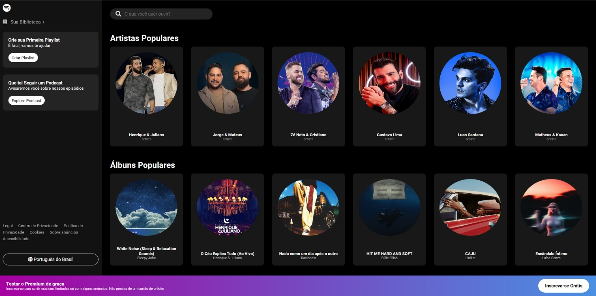

# 🎵 Tela Principal do Spotify

Este projeto foi desenvolvido como um desafio de Front-End para aprimorar habilidades em HTML, CSS e JavaScript. A aplicação recria a interface principal do Spotify, proporcionando uma experiência visual e interativa semelhante à plataforma original.

## ✨ Funcionalidades

- **Layout Fiel ao Original:** Estrutura e estilos semelhantes à interface do Spotify.
- **Interatividade:** Animações e efeitos para uma navegação mais fluida.
- **Modo Escuro:** Mantendo a identidade visual do Spotify.

## 🖥️ Demonstração da Aplicação

- 🔗 **Acesse o projeto online:** [https://spotify-gamma-dun.vercel.app/](https://spotify-gamma-dun.vercel.app/)  

## 🛠️ Tecnologias Utilizadas

- **HTML5 & CSS3:** Estruturação e estilização da interface.
- **JavaScript:** Adição de interatividade na página.
- **Vercel:** Implantação da aplicação para fácil acesso online.

## 📚 Sobre o Projeto

Este projeto foi criado com o objetivo de:

- Aprimorar habilidades em desenvolvimento web.
- Trabalhar com design e estilização avançada.
- Praticar a recriação de interfaces populares utilizando HTML, CSS e JavaScript.

---
